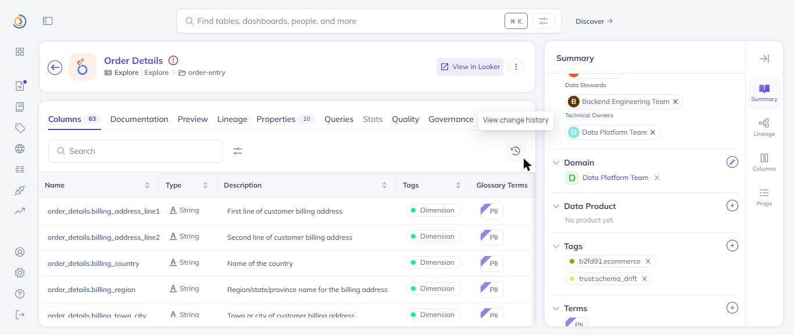
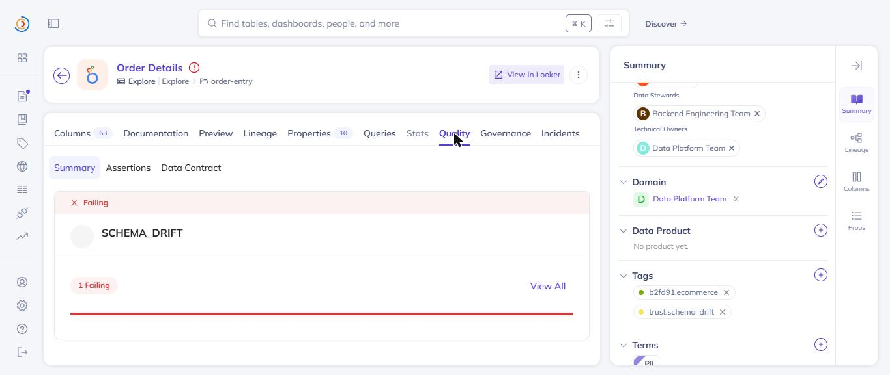
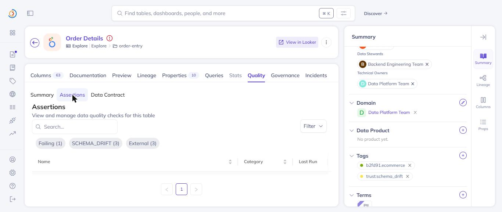

# Write-back to DataHub

When Dataco's scan agent detects a trust issue it **closes the loop** by writing
two artifacts back onto the affected asset in DataHub — so the signal lives in
the catalog, not just in Dataco's own database.

## What gets written

For the example issue in [`scan-result.json`](./scan-result.json)
(`schema_drift` on `lab_ingestion_feed`, severity `critical`):

| Artifact | Value | Where it shows in DataHub |
|---|---|---|
| **Tag** | `trust:schema_drift` (`urn:li:tag:trust:schema_drift`) | On the asset's page header — an at-a-glance trust signal for anyone browsing the catalog. |
| **Custom assertion** | type `schema_drift`, result **FAILURE**, severity **HIGH** | The asset's **Validation** tab — a first-class DataHub assertion with a failing result. |

The tag namespace is configurable via `DATAHUB_TAG_PREFIX` (default `trust`), and
severity maps Dataco `critical`/`high` → assertion `HIGH`, `medium` → `MEDIUM`,
`low` → `LOW`.

## How to reproduce against live DataHub

```bash
cd backend
# tunnel up + DATAHUB_TOKEN in .env
.\.venv\Scripts\python seed_live.py                 # prime a baseline on real URNs
.\.venv\Scripts\python -m uvicorn app.main:app --port 8000 --env-file .env
curl -X POST http://localhost:8000/scan             # detect + explain + write back
```

Then open the asset in the DataHub UI (`localhost:9002`):

- **Asset page** → the `trust:schema_drift` tag is attached.
- **Validation tab** → a Dataco custom assertion with a FAILURE result.

## Screenshots (live run)

Captured against the showcase-ecommerce asset **Order Details**
(`urn:li:dataset:(urn:li:dataPlatform:looker,b2fd91.order-entry.explore.order_details,PROD)`)
after a real `POST /scan`:

**The `trust:schema_drift` tag on the asset** — Tags sidebar, next to the pack's own `b2fd91.ecommerce`:



**The failing assertion** — the asset's Quality tab shows a red ✕ Failing banner with the SCHEMA_DRIFT assertion:



**Assertions list** — filter chips confirm the External (custom) SCHEMA_DRIFT assertion is failing:


